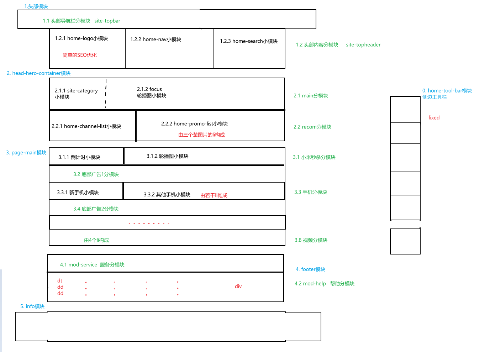
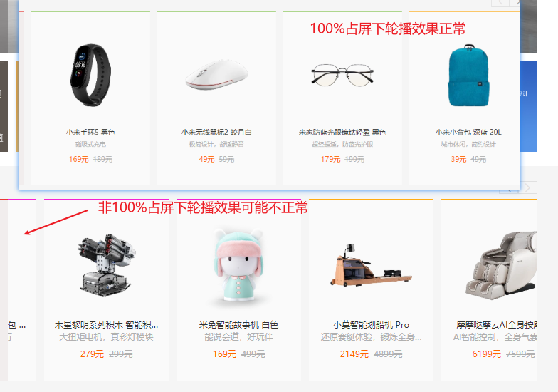

# 项目笔记

## 一.草图

## 二.问题与解决方案

### 1.home-tool-bar  侧边工具栏模块

A.整个模块使用固定定位定到浏览器右侧，发现得到的是绝对定位的效果

原因是在父级中使用了设置了“transform: translate”或“perspective”，子级的固定定位会失效（退化为绝对定位）

解决方法是尽量不要在父级中设置“transform: translate”或“perspective”

### 2.header  头部模块

#### (1)header-nav部分

A.展示列表的盒子被局限在版心内，但是又想得到浏览器的宽度

解决方法：考虑到该盒子需要使用到绝对定位，可以给版心上层具有浏览器宽度的盒子设置相对定位，让展示列表的盒子以此为父级，然后就能用width: 100%; 得到其宽度

由此得出结果，绝对定位继承的宽度来自带有定位的最近一级

#### (2)header-search部分

A.搜索框下拉列表的选项点击没反应

原因是js中设置了搜索框失去焦点，下拉选项就隐藏起来，而点击下拉选项的时刻就是搜索框失去焦点的时刻，这个过程很快，还来不及触发a链接跳转

解决方法：给该失去焦点事件的回调函数添加一个定时器，200ms后再把下拉选项隐藏起来

有些问题悬着，暂时找不到解决方案

以上这个bug最终还是没有找到解决方案，我用多个浏览器分别进行尝试，发现只有火狐在非100%占屏下也能正常显示，谷歌和edge、ie都会不正常显示，我猜想是移动的长度被我写死了，但写活后还是那样，只有火狐能正常显示

或许和浏览器本身的设置有关？