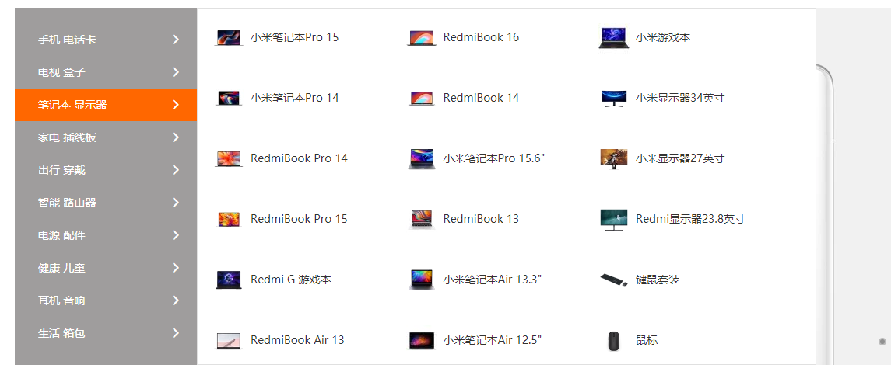

# secondWeek

## 一.学习笔记

### Vue

#### 1.v-model指令

- v-model="message"等价于 
- v-bind:value="message"+
- v-on:input="message=$event.target.value"

##### （1）input(text)和textarea

##### （2）input（radio）单选

##### （3）input（checkout） 单选/复选框

##### （4）select 下拉选项

##### *（5）值绑定

##### （6）修饰符

###### A.lazy

###### B.number

###### C.trim

#### 2.组件化

##### （1）组件化思想

##### （2）组件使用三步骤

##### （3）全局组件和局部组件

##### （4）父组件和子组件

##### （5）语法糖形式

##### （6）组件模板的分离

##### （7）组件中数据存放问题

##### √（8）父子组件的通信

##### （9）父子组件的访问

##### （10）slot插槽

#### 3.前端模块化

#### 4.webpack基本使用

- 在实际开发中，我们会写很多模块化，其中就有js/png/less/css等文件，直接放到服务器让用户来访问是不行的，需要经过模块化打包，生成一个更底层的文件，用户再来服务器访问这个文件就可以看到项目效果了
- webpack就是模块化打包工具
- 这个地方涉及到好多配置和npm安装操作，我只试过对js和css打包，理解得不是很好，后面就是脚手架了，最近不打算学Vue了，先跳过消化消化

## 二.进度笔记

这周完成：

### 1.字体图标、favicon部分

都是小细节，这里就不截图了

### 2.小米秒杀模块的轮播图

悬而未决的问题：响应式效果不好，等学完响应式开发再回来修改

### 3.中间轮播图左侧的列表模块

鼠标经过不同的列表项显示不同的列表内容：

### 4.未完成的重要内容

#### （1）小米秒杀倒计时

#### （2）page-main的tab栏

#### （3）响应式布局的完善

这轴碰到的主要问题是响应式效果的问题